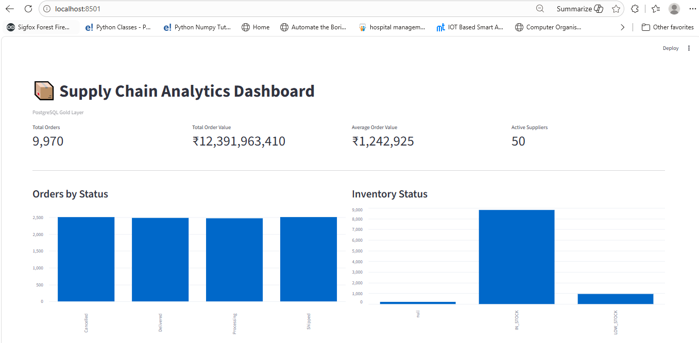

# Supply Chain Data Engineering Pipeline

## Overview

This project implements an end-to-end **Supply Chain Data Engineering Pipeline** that ingests raw supply chain data, performs data quality validation and transformation using **PySpark**, builds a cleaned gold dataset, loads the processed data into **PostgreSQL**, and provides analytical insights through **SQL queries** and an interactive **Streamlit dashboard**.

The project is designed to demonstrate practical data engineering concepts including:

- Python-based data ingestion
- Data profiling and quality validation
- PySpark ETL pipelines
- Data cleaning and transformation
- Gold-layer dataset creation
- PostgreSQL data loading
- SQL-based analytics
- Interactive dashboard development
- Modular and reusable pipeline design

### End-to-End Flow

```text
Raw CSV Data
     │
     ▼
Python Ingestion
     │
     ▼
Data Quality Checks
     │
     ▼
PySpark ETL
     │
     ├──────────────┐
     ▼              ▼
 Orders         Inventory
     │              │
     └──────┬───────┘
            │
            ▼
        Suppliers
            │
            ▼
     Gold Dataset
            │
            ▼
       PostgreSQL
            │
      ┌─────┴─────┐
      ▼           ▼
SQL Analytics   Streamlit
               Dashboard
```

---

## Architecture

The pipeline follows a layered approach where raw data is ingested, validated, transformed, and converted into an analytics-ready gold dataset.

```text
                 CSV DATA
                    │
                    ▼
            Python Ingestion
                    │
                    ▼
             Data Quality
                    │
                    ▼
              PySpark ETL
                    │
          ┌─────────┼─────────┐
          ▼         ▼         ▼
       Orders    Inventory  Suppliers
          │         │         │
          └─────────┼─────────┘
                    │
                    ▼
              Gold Dataset
                    │
                    ▼
               PostgreSQL
                    │
             ┌──────┴──────┐
             ▼             ▼
       SQL Analytics   Streamlit
                       Dashboard
```

---

## Tech Stack

| Technology | Purpose |
|---|---|
| Python | Data ingestion, validation and database loading |
| PySpark | Distributed data transformation and ETL |
| Pandas | Data handling and CSV export |
| PostgreSQL | Relational database and analytics storage |
| SQL | Analytical queries and reporting |
| Streamlit | Interactive data dashboard |
| Faker | Synthetic supply chain data generation |
| Git & GitHub | Version control and project management |

---

## Dataset

The project uses synthetic supply chain data generated using Python and Faker.

Three primary datasets are used:

### Suppliers

Contains supplier-level information.

Fields:

- `supplier_id`
- `supplier_name`
- `country`
- `delivery_days`
- `quality_rating`

Initial records:

**50 suppliers**

---

### Inventory

Contains warehouse and inventory information.

Fields:

- `product_id`
- `warehouse_id`
- `stock_quantity`
- `reorder_level`
- `last_updated`

Initial records:

**500 inventory records**

After validation:

**490 valid records**

---

### Orders

Contains customer/order transaction information.

Fields:

- `order_id`
- `product_id`
- `supplier_id`
- `order_date`
- `quantity`
- `unit_price`
- `status`

Initial records:

**10,020 orders**

After data cleaning:

**9,970 valid orders**

---

## Data Pipeline

### 1. Data Generation

Synthetic supply chain data is generated using Python and Faker.

The generated datasets intentionally contain data quality issues such as:

- Duplicate orders
- Missing supplier IDs
- Invalid order quantities
- Missing inventory quantities

This allows the pipeline to demonstrate real-world data quality handling.

---

### 2. Python Ingestion

The ingestion layer loads the raw CSV files and performs initial profiling.

The ingestion process checks:

- Number of records
- Number of columns
- Missing values
- Duplicate records
- Dataset structure

Example:

```text
ORDERS
Rows: 10020
Columns: 7
Missing supplier_id: 21
Duplicate order_id: 20
```

---

### 3. Data Quality Validation

The quality layer identifies invalid or inconsistent records before the data reaches the analytics layer.

The pipeline checks for:

- Missing values
- Duplicate IDs
- Negative quantities
- Invalid stock quantities
- Invalid reorder levels
- Invalid supplier ratings
- Invalid delivery days

---

### 4. PySpark ETL

PySpark is used to perform the main transformation and cleaning operations.

#### Orders

The orders pipeline:

1. Removes duplicate `order_id`
2. Removes records with missing `supplier_id`
3. Removes records with invalid quantities
4. Converts `order_date` into a date field
5. Produces the cleaned orders dataset

```text
Raw Orders:                 10,020
After duplicate removal:    10,000
After missing suppliers:     9,980
After invalid quantities:    9,970
```

---

### 5. Inventory Transformation

Inventory data is validated using the following rules:

- `stock_quantity >= 0`
- `reorder_level >= 0`
- Missing stock quantities are removed

A derived field called `stock_status` is created:

```text
IF stock_quantity < reorder_level
    → LOW_STOCK
ELSE
    → IN_STOCK
```

Final inventory records:

**490**

---

### 6. Supplier Transformation

Supplier data is validated using:

- Valid `supplier_id`
- `delivery_days >= 0`
- `quality_rating` between 0 and 5

A derived field called `quality_category` is created:

```text
IF quality_rating >= 4
    → HIGH_QUALITY
ELSE
    → STANDARD
```

Final supplier records:

**50**

---

## Gold Dataset

After cleaning the individual datasets, the pipeline joins:

- Orders
- Inventory
- Suppliers

The resulting dataset is stored as:

```text
data/processed/gold_supply_chain.csv
```

The gold dataset contains:

- `order_id`
- `order_date`
- `product_id`
- `supplier_id`
- `supplier_name`
- `country`
- `delivery_days`
- `quality_rating`
- `quality_category`
- `quantity`
- `unit_price`
- `total_order_value`
- `status`
- `stock_quantity`
- `reorder_level`
- `stock_status`

The pipeline calculates:

```text
total_order_value = quantity × unit_price
```

Final gold records:

**9,970**

---

## Data Quality

The project includes dedicated data quality checks before and after transformation.

### Detected Issues

| Dataset | Quality Issue | Count |
|---|---|---:|
| Orders | Missing supplier ID | 21 |
| Orders | Duplicate order IDs | 20 |
| Orders | Invalid quantities | 10 |
| Inventory | Missing stock quantity | 10 |
| Suppliers | Invalid records | 0 |

### Cleaning Results

| Dataset | Raw Records | Clean Records |
|---|---:|---:|
| Orders | 10,020 | 9,970 |
| Inventory | 500 | 490 |
| Suppliers | 50 | 50 |
| Gold Dataset | — | 9,970 |

The quality checks help prevent invalid records from reaching the final analytics layer.

---

## PostgreSQL Data Model

PostgreSQL is used as the analytical database for the processed datasets.

The following tables are created:

```text
suppliers
inventory
orders
gold_supply_chain
```

Final table sizes:

```text
suppliers          → 50
inventory          → 490
orders             → 9,970
gold_supply_chain  → 9,970
```

The gold table acts as the primary analytics table used by the SQL queries and Streamlit dashboard.

---

## SQL Analytics

The project includes analytical SQL queries for supply chain reporting.

The SQL analytics layer covers:

### 1. Overall Order Performance

Provides overall order volume and order value metrics.

### 2. Orders by Status

Analyzes order distribution across:

- Shipped
- Cancelled
- Delivered
- Processing

### 3. Inventory Status

Identifies:

- In-stock products
- Low-stock products

### 4. Supplier Quality Performance

Analyzes suppliers based on their quality category and order performance.

### 5. Top Suppliers by Order Value

Identifies suppliers contributing the highest order value.

### 6. Product Performance

Analyzes products based on total order value.

### 7. Country-Level Performance

Provides supply chain performance by supplier country.

### 8. Low-Stock Products

Identifies products where inventory has fallen below the reorder level.

---

## Streamlit Dashboard

The project includes an interactive Streamlit dashboard connected directly to PostgreSQL.

The dashboard provides:

- Total Orders
- Total Order Value
- Average Order Value
- Active Suppliers
- Orders by Status
- Inventory Status
- Top 10 Suppliers by Order Value
- Country Performance
- Low Stock Products

### Dashboard



---

## Project Structure

```text
supply-chain-data-pipeline/
│
├── data/
│   ├── suppliers.csv
│   ├── inventory.csv
│   ├── orders.csv
│   └── processed/
│
├── ingestion/
│   └── load_data.py
│
├── spark/
│   ├── clean.py
│   ├── clean_inventory.py
│   ├── clean_suppliers.py
│   └── build_gold.py
│
├── quality/
│   ├── data_quality.py
│   └── gold_quality.py
│
├── database/
│   ├── analytics.sql
│   └── load_to_postgres.py
│
├── dashboard/
│   └── app.py
│
├── tests/
│
├── docs/
│   └── dashboard.PNG
│
├── requirements.txt
├── README.md
└── .gitignore
```

---

## How to Run

### 1. Clone the Repository

```bash
git clone https://github.com/devasheesh1112/supply-chain-data-pipeline.git
cd supply-chain-data-pipeline
```

---

### 2. Create Virtual Environment

```bash
python -m venv venv
```

Activate it on Windows:

```bash
venv\Scripts\activate
```

---

### 3. Install Dependencies

```bash
pip install -r requirements.txt
```

---

### 4. Generate Data

Run:

```bash
python data/generate_data.py
```

This generates the synthetic supply chain datasets.

---

### 5. Run Data Ingestion

```bash
python ingestion/load_data.py
```

This profiles the raw datasets and reports data quality information.

---

### 6. Run Data Quality Checks

```bash
python quality/data_quality.py
```

---

### 7. Run PySpark Transformations

Clean orders:

```bash
python spark/clean.py
```

Clean inventory:

```bash
python spark/clean_inventory.py
```

Clean suppliers:

```bash
python spark/clean_suppliers.py
```

Build the gold dataset:

```bash
python spark/build_gold.py
```

---

### 8. Load Data into PostgreSQL

Configure the database connection using environment variables.

Example:

```text
DB_HOST=127.0.0.1
DB_PORT=5432
DB_NAME=supply_chain
DB_USER=postgres
DB_PASSWORD=your_password
```

Then run:

```bash
python database/load_to_postgres.py
```

---

### 9. Run SQL Analytics

Connect to the PostgreSQL database and execute:

```text
database/analytics.sql
```

---

### 10. Launch Streamlit Dashboard

Run:

```bash
streamlit run dashboard/app.py
```

The dashboard will be available locally through the Streamlit URL shown in the terminal.

---

## Key Engineering Decisions

### PySpark for ETL

PySpark was selected for the transformation layer to demonstrate scalable data processing and distributed ETL concepts.

### Data Quality Before Analytics

Data quality validation is performed before creating the final gold dataset so that invalid records do not flow into the analytics layer.

### Gold Dataset

A separate gold dataset provides a clean, analytics-ready representation of the supply chain data.

### PostgreSQL as Analytics Layer

PostgreSQL provides structured storage and enables SQL-based reporting and analytical queries.

### Streamlit for Visualization

Streamlit provides a lightweight way to expose the analytical results through an interactive dashboard.

### Modular Pipeline

The project separates ingestion, transformation, quality checks, database loading, and visualization into independent modules.

This makes the pipeline easier to maintain, test, and extend.

---

## Results

The completed pipeline processes the generated supply chain datasets through ingestion, quality validation, PySpark transformation, PostgreSQL loading, SQL analytics, and dashboard visualization.

### Final Dataset

```text
Orders
10,020 → 9,970

Inventory
500 → 490

Suppliers
50 → 50

Gold Dataset
9,970 records
```

### Order Value

Total order value across the cleaned gold dataset:

```text
12,391,963,409.97
```

### Order Status Distribution

```text
Shipped       2,508
Cancelled     2,507
Delivered     2,483
Processing    2,472
```

### Inventory Status

```text
IN_STOCK      8,818
LOW_STOCK       947
```

### Supplier Quality

```text
HIGH_QUALITY  6,134
STANDARD      3,836
```

These metrics are generated from the final cleaned gold dataset and are also exposed through the PostgreSQL analytics layer and Streamlit dashboard.

---

## Future Improvements

Potential improvements for the pipeline include:

- Add Apache Airflow for workflow orchestration
- Add incremental data processing
- Introduce a data warehouse such as Snowflake or BigQuery
- Add automated data quality monitoring
- Add CI/CD using GitHub Actions
- Add containerization using Docker
- Add unit and integration test coverage
- Add pipeline logging and monitoring
- Introduce partitioning for larger datasets
- Add role-based access control for database and dashboard users

---

## Author

**Devasheesh Patidar**

GitHub:  
https://github.com/devasheesh1112

## Dashboarddddddddd

